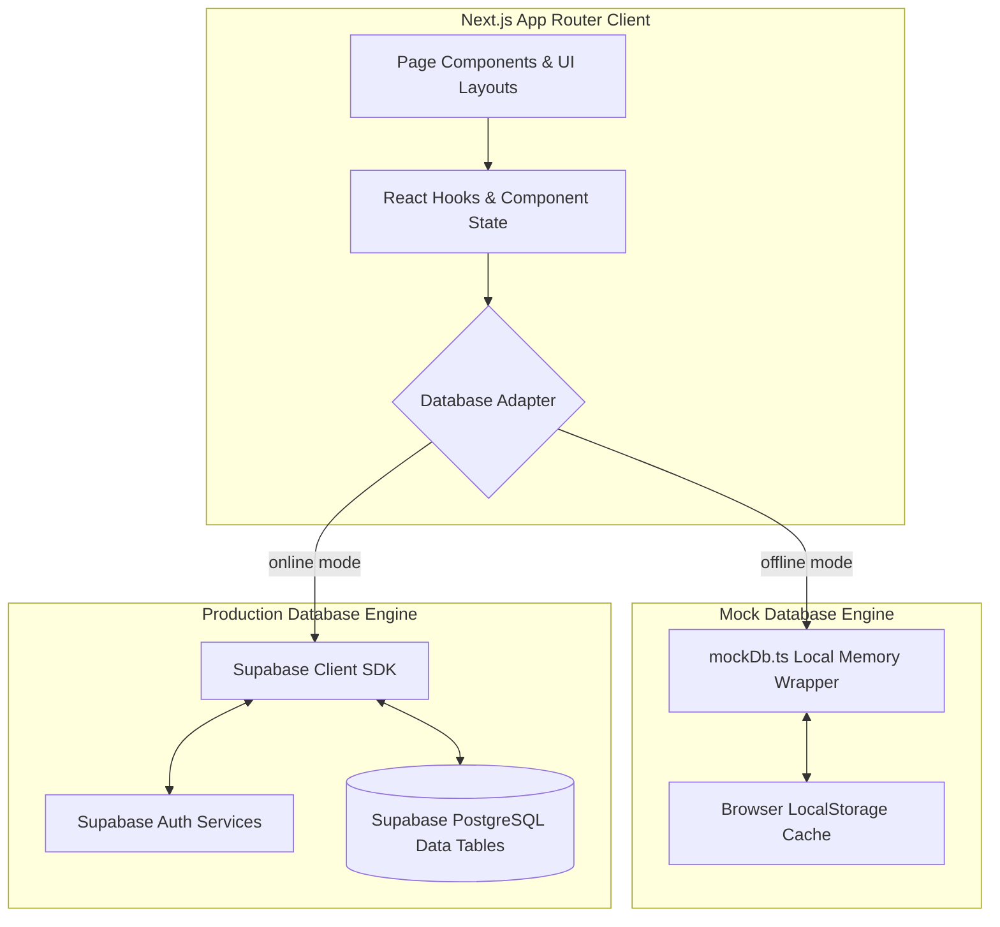
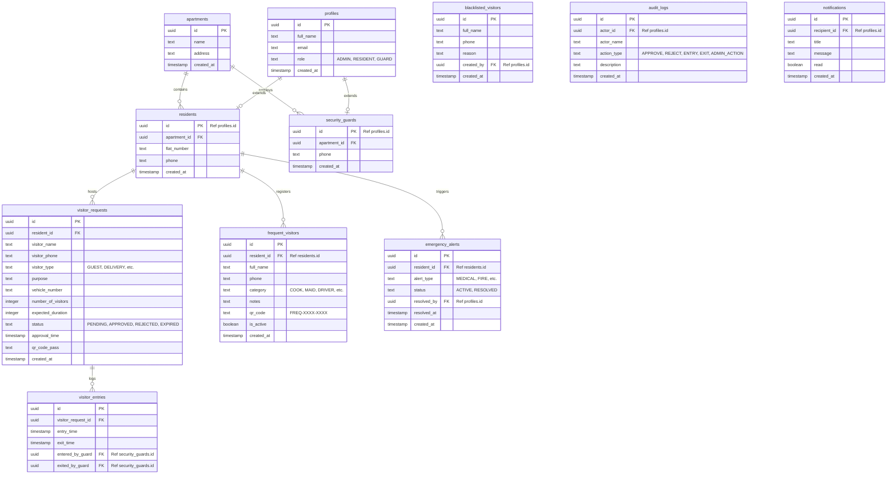
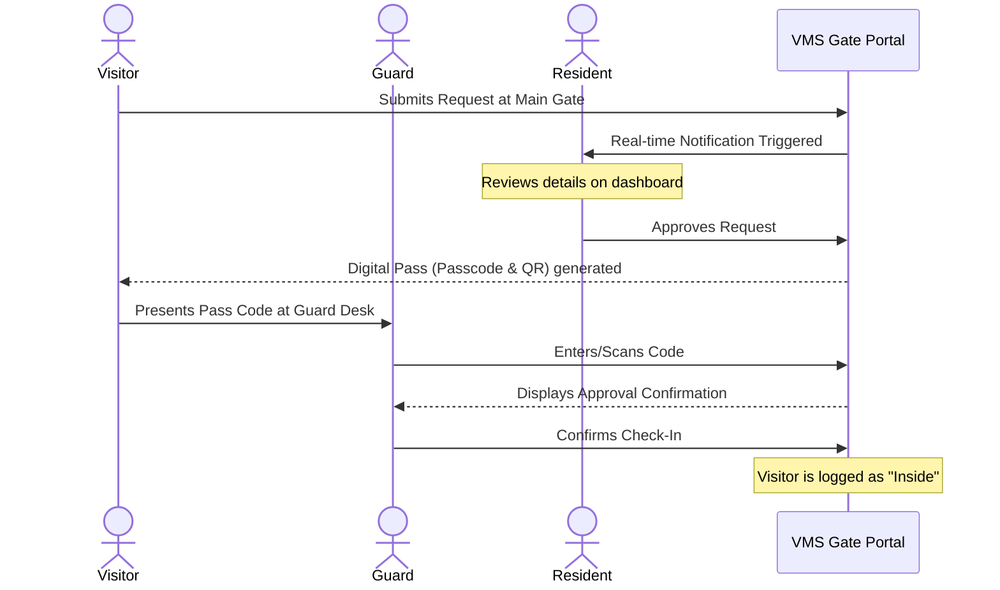
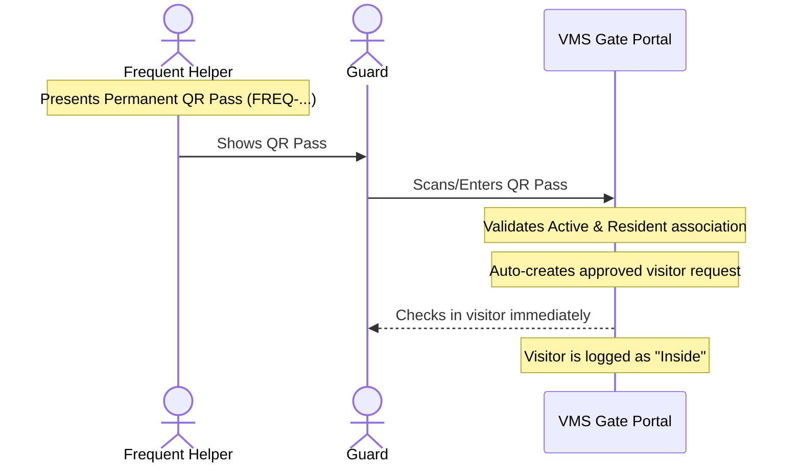
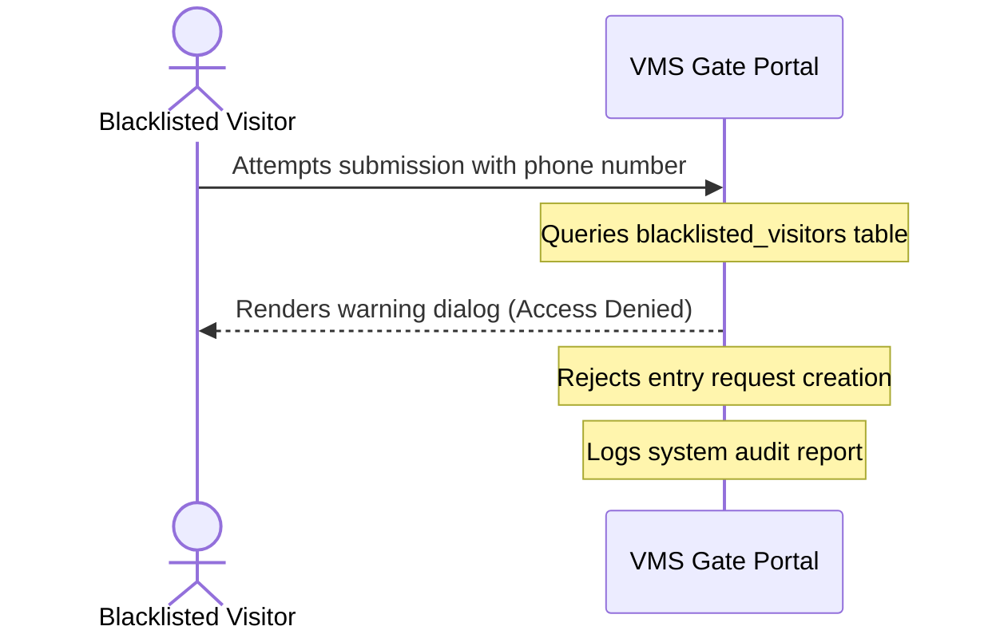

# VMS Architecture Documentation

This document describes the application architecture, database relationships, and key visitor check-in flows in the Apartment Visitor Management System.

---

## 1. System Architecture Diagram

The system follows a modern decoupled React/Next.js client architecture with dual-mode data adapters supporting both local storage (Mock Mode) and Supabase (Production Mode).

---

## 2. Database Schema Relationships

Here is the database schema mapping including the new tables (`frequent_visitors`, `blacklisted_visitors`, `emergency_alerts`) and audit tables:

---

## 3. Visitor Check-in Workflows

### Standard Check-In Flow

### Trusted Entry Flow (Frequent Visitors)

### Blacklisted Visitor Attempt Flow

